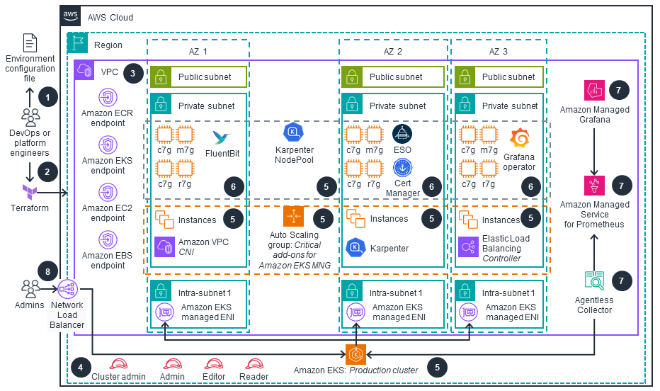

# Guidance for Automated Provisioning of Application-Ready Amazon EKS Clusters

## Table of Contents

1. [Overview](#overview)
  - [Features and Benefits](#features-and-benefits)
  - [Use cases](#use-cases) 
  - [Architecture](#architecture-overview)
  - [AWS services in this Guidance](#aws-services-in-this-guidance)
  - [Cost](#cost)
2. [Prerequisites](#prerequisites)
  - [Operating System](#operating-system)
  - [Third-Party Tools](#third-party-tools)
3. [Deployment Steps](#deploy-the-guidance)
4. [License](#license)

## Overview

The Guidance for Automated Provisioning of Application-Ready Amazon EKS Clusters is a collection of reference implementations for Amazon Elastic Kubernetes Service (EKS) designed to accelerate time it takes to launch a workload-ready EKS cluster. It includes an "opinionated" set of pre-configured and integrated tools/add-ons and follows best practices to support core capabilities including Autoscaling, Observability, Networking and Security.

This guidance addresses the following key points:

- Provides a simplified process for setting up an application-ready EKS cluster.
- Includes pre-configured tools and add-ons to support essential capabilities.
- Aims to reduce the learning curve associated with deploying an application-ready EKS cluster.
- Allows users to focus on deploying and testing applications rather than cluster setup.

The motivation behind this project is to accelerate and simplify the process of setting up a cluster that is ready to support applications and workloads. We've heard from customers that there can be a learning curve associated with deploying your first application ready EKS cluster. This project aims to simplify the undifferentiated lifting, allowing you to focus on deploying and testing your applications.

## Features and Benefits

1. **Single Cluster Deployment**: Deploy one Amazon EKS cluster per environment in a single account, simplifying management and reducing complexity for users new to Kubernetes.

2. **Ready-to-Use Configuration**: Receive a pre-configured cluster with opinionated yet customizable tooling, accelerating the setup process and reducing the learning curve for containerization beginners.

3. **Environment-Specific Customization**: Easily tailor cluster configurations for different environments (dev, staging, prod), enabling flexible and consistent multi-environment setups.

4. **Integrated Tooling**: Benefit from pre-integrated tools and add-ons that support core capabilities like Autoscaling, Observability, Networking, and Security, reducing the time and expertise needed to set up a production-ready cluster.

5. **Best Practices Implementation**: Automatically apply AWS and Kubernetes best practices, enhancing security, performance, and cost-efficiency without requiring deep expertise.

6. **Terraform-Based Deployment**: Utilize Terraform for infrastructure-as-code deployment, ensuring reproducibility and easier management of cluster configurations across environments.

This reference implementation is designed for customers that require a simple ready-to-use cluster, configured with a set of opinionated (yet configurable to some extent) tooling deployed alongside the cluster itself. The ideal customer profile includes:

- Organizations in the early stages of containerization/Kubernetes adoption looking for a simplified deployment to run their applications
- Teams with limited resources to manage cluster configurations
- Projects with applications that can be deployed in a single cluster
- Business units within an organization that need to deploy a multi-environment cluster for their specific workloads

## Use Cases

1. **Accelerating Initial Kubernetes Adoption**
Streamlining the transition to containerization for organizations new to Kubernetes/EKS.
This use case addresses organizations in the early stages of adopting containerization and Kubernetes. The reference implementation provides a pre-configured, production-ready EKS cluster, reducing the complexity of initial setup. It allows teams to focus on application containerization rather than cluster configuration, accelerating the path to leveraging containerized workloads.

2. **Optimizing DevOps Resources in Early Kubernetes Adoption Stages**
Enabling efficient cluster management for teams new to Kubernetes operations. For organizations in the early phases of Kubernetes adoption, DevOps teams often need to balance learning new technologies with maintaining existing systems. This implementation offers a pre-configured EKS cluster with best practices in security and scalability. It reduces the initial operational burden, allowing teams to gradually build Kubernetes expertise while maintaining productivity.

3. **Simplified Single-Cluster Deployment for Initial Projects**
Providing a streamlined infrastructure for initial Kubernetes applications. This use case caters to teams deploying their first applications on Kubernetes. The reference implementation offers a robust, single-cluster environment per development stage. It's ideal for initial projects that need containerization benefits without multi-cluster complexity, allowing teams to start small and scale as they gain experience.

4. **Consistent Multi-Environment Setup for Kubernetes Newcomers**
Facilitating uniform cluster deployments across dev, staging, and production for teams new to Kubernetes. For organizations setting up their first Kubernetes environments, maintaining consistency across development stages is crucial. This implementation uses Terraform and environment-specific configurations to ensure identical setups across dev, staging, and production. It helps teams new to Kubernetes establish a solid foundation for their development pipeline from the start.

5. **Adopting Terraform and AWS Best Practices for Amazon EKS**
Implementing infrastructure-as-code and AWS-recommended configurations for EKS deployments. This use case is tailored for organizations aiming to adopt or improve their DevOps practices using Terraform while leveraging AWS best practices for EKS. The reference implementation provides a Terraform-based deployment that incorporates AWS-recommended configurations for EKS. It allows teams to quickly implement infrastructure-as-code methodologies, ensuring reproducibility and version control of their EKS environments. Simultaneously, it applies AWS best practices, optimizing security, performance, and cost-efficiency. This approach enables companies to accelerate their DevOps transformation while ensuring their EKS deployments align with industry standards and AWS expertise.

## Architecture Overview

This section provides a reference implementation architecture diagram for the components deployed with this Guidance.

At its core, the solution deploys an Amazon EKS cluster within a custom Amazon VPC. This VPC is configured with public and private subnets across multiple Availability Zones for high availability and resilience.

Key elements of the architecture include:

1. [**Amazon VPC**](https://aws.amazon.com/vpc/): A custom VPC with public and private subnets, providing network isolation and security.
2. [**Amazon EKS Cluster**](https://aws.amazon.com/eks/): The central component, managing the Kubernetes control plane and compute nodes
3. [**EKS Managed Node Groups**](https://docs.aws.amazon.com/eks/latest/userguide/managed-node-groups.html): Auto-scaling groups of EC2 instances that serve as EKS compute nodes.
4. [**Amazon Identity & Access Management**](https://aws.amazon.com/iam/): Integrated with EKS for fine-grained access control.
5. [**Amazon Elastic Container Registry (ECR)**](http://aws.amazon.com/ecr/): For storing and managing container images.
6. [**AWS Load Balancer Controller**](https://aws.amazon.com/blogs/networking-and-content-delivery/deploying-aws-load-balancer-controller-on-amazon-eks/): Automatically provisions Application Load Balancers or Network Load Balancers when a Kubernetes service of type LoadBalancer is created.
7. **Observability Tools**: [Amazon CloudWatch](https://aws.amazon.com/cloudwatch/), [Amazon Managed Grafana](https://aws.amazon.com/grafana/), and [Amazon Managed Service for Prometheus](https://aws.amazon.com/prometheus/) for comprehensive monitoring and logging.
8. [**Terraform Resources**](https://www.hashicorp.com/products/terraform): Representing  infrastructure-as-code components that define and provision the guidance architecture.

This architecture is designed to provide a secure, scalable, and easily manageable EKS environment, incorporating AWS best practices and ready for production workloads.

### Architecture Diagram

 
 
<i>Figure 1:  Application-Ready Amazon EKS Cluster Reference architecture </i>

### Architecture Steps

1. DevOps engineer defines a per-environment [Terraform variable file](https://developer.hashicorp.com/terraform/language/values/variables#variable-definitions-tfvars-files) that controls all of the environment-specific configuration. This variable file is used in every step of the process by all IaC configurations.

2. DevOps engineer applies the environment configuration using Terraform following the deployment process defined in the guidance.

3. An [Amazon Virtual Private Cloud (VPC)](https://aws.amazon.com/vpc/) is provisioned and configured based on specified configuration. According to best practices for Reliability, 3 Availability Zones (AZs) are configured with VPC Endpoints for access to resources deployed in private VPC. Provisioned resources for private clusters, including [Amazon Elastic Container Registry (Amazon ECR)](http://aws.amazon.com/ecr/), [Amazon EKS]((https://aws.amazon.com/eks/), [Amazon Elastic Compute Cloud (Amazon EC2)](http://aws.amazon.com/ec2/), and [Amazon Elastic Block Store (Amazon EBS)](http://aws.amazon.com/ebs/) are available via corresponding VPC endpoints.

4. User-facing [AWS Identity and Access Management (IAM)](https://aws.amazon.com/iam/) roles (Cluster Admin, Admin, Editor and Reader) are created for various access levels to EKS cluster resources, as recommended in Kubernetes security best practices.

5. [Amazon Elastic Kubernetes Service (Amazon EKS)](https://aws.amazon.com/eks/) cluster is provisioned with Managed Node Groups that host critical cluster add-ons (CoreDNS, AWS Load Balancer Controller and [Karpenter](https://karpenter.sh/)) on its compute node instances. Karpenter manages compute capacity for other add-ons, as well as business applications that will be deployed by users while prioritizing provisioning [AWS Graviton](https://aws.amazon.com/ec2/graviton/) based compute node instances for the best price-performance.

6. Other important EKS add-ons are provisioned based on the configurations defined in the per-environment Terraform configuration file.

7. AWS OSS Observability stack is deployed if configured, including [Amazon Managed Service for Prometheus (AMP)](https://aws.amazon.com/prometheus/), [AWS Managed Collector for Amazon EKS](https://docs.aws.amazon.com/prometheus/latest/userguide/AMP-collector.html), and [Amazon Managed Grafana (AMG)](https://aws.amazon.com/grafana/). In addition, a Grafana-operator addon is deployed alongside a set of predefined Grafana dashboards to get started.

8. Amazon EKS cluster(s) with critical add-ons, configured managed Observability stack and RBAC based security mapped to IAM roles is available for workload deployment and its Kubernetes API is exposed via an [AWS Network Load Balancer](https://aws.amazon.com/elasticloadbalancing/network-load-balancer/).

### AWS services in this Guidance

| **AWS Service** | **Role** | **Description** |
|-----------------|----------|-----------------|
| [Amazon Elastic Kubernetes Service](https://aws.amazon.com/eks/) ( EKS) | Core service | Manages the Kubernetes control plane and worker nodes for container orchestration. |
| [Amazon Elastic Compute Cloud](https://aws.amazon.com/ec2/) (EC2) | Core service | Provides the compute instances for EKS worker nodes and runs containerized applications. |
| [Amazon Virtual Private Cloud](https://aws.amazon.com/vpc/) (VPC) | Core Service | Creates an isolated network environment with public and private subnets across multiple Availability Zones. |
| [Amazon Elastic Container Registry](http://aws.amazon.com/ecr/) (ECR) | Supporting service | Stores and manages Docker container images for EKS deployments. |
| [Elastic Load Balancing](https://aws.amazon.com/elasticloadbalancing/) (NLB) | Supporting service | Distributes incoming traffic across multiple targets in the EKS cluster. |
| [Amazon Elastic Block Store](https://aws.amazon.com/ebs) (EBS) | Supporting service | Provides persistent block storage volumes for EC2 instances in the EKS cluster. |
| [AWS Identity and Access Management](https://aws.amazon.com/iam/) (IAM) | Supporting service | Manages access to AWS services and resources securely, including EKS cluster access. |
| [Amazon Managed Grafana](https://aws.amazon.com/grafana/) (AMG) | Observability service | Provides fully managed  service for metrics visualization and monitoring. |
| [Amazon Managed Service for Prometheus](https://aws.amazon.com/prometheus/) (AMP) | Observability service | Offers managed Prometheus-compatible monitoring for container metrics. |
| [AWS Certificate Manager](https://aws.amazon.com/certificate-manager/) (ACM) | Security service | Manages SSL/TLS certificates for secure communication within the cluster. |
| [Amazon CloudWatch](https://aws.amazon.com/cloudwatch/) | Monitoring service | Collects and tracks metrics, logs, and events from EKS and other AWS resources provisoned in the guidance |
| [AWS Systems Manager](https://aws.amazon.com/systems-manager/) | Management service | Provides operational insights and takes action on AWS resources. |
| [AWS Key Management Service](https://aws.amazon.com/kms/) (KMS) | Security service | Manages encryption keys for securing data in EKS and other AWS services. |

## Plan your deployment

### Cost

You are responsible for the cost of the AWS services used while running this guidance. 
As of August 2024, the cost for running this guidance with the default settings in the US East (N. Virginia) Region is approximately **$447.47/month**.

We recommend creating a [budget](https://alpha-docs-aws.amazon.com/awsaccountbilling/latest/aboutv2/budgets-create.html) through [AWS Cost Explorer](http://aws.amazon.com/aws-cost-management/aws-cost-explorer/) to help manage costs. Prices are subject to change. For full details, refer to the pricing webpage for each AWS service used in this guidance.

### Sample cost table

The following table provides a sample cost breakdown for deploying this guidance with the default parameters in the `us-east-1` (N. Virginia) Region for one month. This estimate is based on the AWS Pricing Calculator output for the full deployment as per the guidance.

| **AWS service** | Dimensions | Cost, month [USD] |
|-----------------|------------|-------------------|
| Amazon EKS | 1 cluster | $73.00 |
| Amazon VPC | 3 NAT Gateways | $98.67 |
| Amazon EC2 | 2 m6g.large instances | $112.42 |
| Amazon Managed Service for Prometheus (AMP) | Metric samples, storage, and queries | $100.60 |
| Amazon Managed Grafana (AMG) | Metrics visualization - Editor and Viewer users | $14.00 |
| Amazon EBS | gp2 storage volumes and snapshots | $17.97 |
| Application Load Balancer | 1 ALB for workloads | $16.66 |
| Amazon VPC | Public IP addresses | $3.65 |
| AWS Key Management Service (KMS) | Keys and requests | $7.00 |
| Amazon CloudWatch | Metrics | $3.00 |
| Amazon ECR | Data storage | $0.50 |
| **TOTAL** |  | **$447.47/month** |

For a more accurate estimate based on your specific configuration and usage patterns, we recommend using the [AWS Pricing Calculator](https://calculator.aws).

## Security

When you build systems on AWS infrastructure, security responsibilities are shared between you and AWS. This [shared responsibility model](https://aws.amazon.com/compliance/shared-responsibility-model/) reduces your operational burden because AWS operates, manages, and controls the components including the host operating system, the virtualization layer, and the physical security of the facilities in which the services operate. For more information about AWS security, visit [AWS Cloud Security](http://aws.amazon.com/security/).

This guidance implements several security best practices and AWS services to enhance the security posture of your EKS Workload Ready Cluster. Here are the key security components and considerations:

### Identity and Access Management (IAM)

- **IAM Roles**: The architecture uses predefined IAM roles (Cluster Admin, Admin, Edit, Read) to manage access to the EKS cluster resources. This follows the principle of least privilege, ensuring users and services have only the permissions necessary to perform their tasks.
- **EKS Managed Node Groups**: These use IAM roles with specific permissions required for nodes to join the cluster and for pods to access AWS services.

### Network Security

- **Amazon VPC**: The EKS cluster is deployed within a custom VPC with public and private subnets across multiple Availability Zones, providing network isolation.
- **Security Groups**: Although not explicitly shown in the diagram, security groups are typically used to control inbound and outbound traffic to EC2 instances and other resources within the VPC.
- **NAT Gateways**: Deployed in public subnets to allow outbound internet access for resources in private subnets while preventing inbound access from the internet.

### Data Protection

- **Amazon EBS Encryption**: EBS volumes used by EC2 instances are typically encrypted to protect data at rest.
- **AWS Key Management Service (KMS)**: Used for managing encryption keys for various services, including EBS volume encryption.

### Kubernetes-specific Security

- **Kubernetes RBAC**: Role-Based Access Control is implemented within the EKS cluster to manage fine-grained access to Kubernetes resources.
- **AWS Certificate Manager**: Integrated to manage SSL/TLS certificates for secure communication within the cluster.

### Monitoring and Logging

- **Amazon CloudWatch**: Used for monitoring and logging of AWS resources and applications running on the EKS cluster.
- **Amazon Managed Grafana and Prometheus**: Provide additional monitoring and observability capabilities, helping to detect and respond to security events.

### Container Security

- **Amazon ECR**: Stores container images in a secure, encrypted repository. It includes vulnerability scanning to identify security issues in your container images.

### Secrets Management

- **AWS Secrets Manager**: While not explicitly shown in the diagram, it's commonly used to securely store and manage sensitive information such as database credentials, API keys, and other secrets used by applications running on EKS.

### Additional Security Considerations

- Regularly update and patch EKS clusters, worker nodes, and container images.
- Implement network policies to control pod-to-pod communication within the cluster.
- Use Pod Security Policies or Pod Security Standards to enforce security best practices for pods.
- Implement proper logging and auditing mechanisms for both AWS and Kubernetes resources.
- Regularly review and rotate IAM and Kubernetes RBAC permissions.

## Supported AWS Regions

The core components of the Guidance for Automated Provisioning of Application-Ready Amazon EKS Clusters are available in all AWS Regions where Amazon EKS is supported.

The observability components of this guidance use Amazon Managed Service for Prometheus (AMP) and Amazon Managed Grafana (AMG). These services are available in the following regions:

| Region Name | Region Code |
|-------------|-------------|
| US East (N. Virginia) | us-east-1 |
| US East (Ohio) | us-east-2 |
| US West (Oregon) | us-west-2 |
| Asia Pacific (Mumbai) | ap-south-1 |
| Asia Pacific (Seoul) | ap-northeast-2 |
| Asia Pacific (Singapore) | ap-southeast-1 |
| Asia Pacific (Sydney) | ap-southeast-2 |
| Asia Pacific (Tokyo) | ap-northeast-1 |
| Europe (Frankfurt) | eu-central-1 |
| Europe (Ireland) | eu-west-1 |
| Europe (London) | eu-west-2 |
| Europe (Paris) | eu-west-3 |
| Europe (Stockholm) | eu-north-1 |
| South America (São Paulo) | sa-east-1 |

### Regions Supporting Core Components Only

The core components of this Guidance can be deployed in any AWS Region where Amazon EKS is available. This includes all commercial AWS Regions except for the China Regions and the AWS GovCloud (US) Regions.

For the most current availability of AWS services by Region, refer to the [AWS Regional Services List](https://aws.amazon.com/about-aws/global-infrastructure/regional-product-services/).

Note: If you deploy this guidance into a region where AMP and/or AMG are not available, you can disable the OSS observability tooling during deployment. This allows you to use the core components of the guidance without built-in observability features.

### Quotas

**NOTICE**
Service quotas, also referred to as limits, are the maximum number of service resources or operations for your AWS account.

### Quotas for AWS services in this Guidance

Ensure you have sufficient quota for each of the AWS services utilized in this guidance. For more details, refer to [AWS service quotas](https://docs.aws.amazon.com/general/latest/gr/aws_service_limits.html).

If you need to view service quotas across all AWS services within the documentation, you can conveniently access this information in the [Service endpoints and quotas](https://docs.aws.amazon.com/general/latest/gr/aws-general.pdf#aws-service-information) page in the PDF.

For specific implementation quotas, consider the following key components and services used in this guidance:

- **Amazon EKS**: Ensure that your account has sufficient quotas for Amazon EKS clusters, node groups, and related resources.
- **Amazon EC2**: Verify your EC2 instance quotas, as EKS node groups rely on these.
- **Amazon VPC**: Check your VPC quotas, including subnets and Elastic IPs, to support the networking setup.
- **Amazon EBS**: Ensure your account has sufficient EBS volume quotas for persistent storage.
- **IAM Roles**: Verify that you have the necessary quota for IAM roles, as these are critical for securing your EKS clusters.
- **AWS Systems Manager**: Review the quota for Systems Manager resources, which are used for operational insights and management.
- **AWS Secrets Manager**: If you're using Secrets Manager for storing sensitive information, ensure your quota is adequate.

## Deploy the Guidance

### Prerequisites

Before deploying this guidance, please ensure you have met the following prerequisites:

1. **AWS Account and Permissions**: Ensure you have an active AWS account with appropriate permissions to create and manage AWS resources like Amazon EKS, EC2, IAM, and VPC.

2. **AWS CLI and Terraform Installation**: Install and configure the [AWS CLI](https://aws.amazon.com/cli/) and [Terraform](https://www.terraform.io/downloads.html) tools on your local machine.

3. **Makefile Setup**: This guidance uses a `Makefile` to automate various tasks related to managing the Terraform infrastructure. Ensure `make` utility is installed on your system.

4. **S3 Bucket and DynamoDB Table**: Set up an S3 bucket and DynamoDB table for storing Terraform state and providing a locking mechanism for managing deployments across environments.

5. **Environment Variables**: Set the required environment variables, including `AWS_REGION` and `AWS_PROFILE`, to specify the AWS region and profile for deployment.

6. **VPC and Network Configuration**: Ensure that you have a VPC configuration ready or are prepared to deploy a new VPC as part of this guidance, with public and private subnets across multiple Availability Zones.

7. **IAM Roles**: Define and configure the necessary IAM roles and policies required for accessing the Amazon EKS cluster and related resources.

8. **Observability Tools (Optional)**: If using the AWS OSS observability stack, ensure the necessary services like Amazon Managed Service for Prometheus and Amazon Managed Grafana are configured. Since AMG uses [IAM Identity Center](https://docs.aws.amazon.com/grafana/latest/userguide/authentication-in-AMG-SSO.html) to provide authentication to its Workspace, you'll have to enable IAM Identity center before deploying this pattern.

<!--
For further examples, refer to [Dynamic Object and Rule Extensions for AWS Network Firewall](https://docs.aws.amazon.com/solutions/latest/dynamic-object-and-rule-extensions-for-aws-network-firewall/deployment.html) and [Scale-Out Computing on AWS](https://docs.aws.amazon.com/solutions/latest/scale-out-computing-on-aws/deployment.html).
-->
### Deployment Instructions

Please refer to [Full Implementation Guide](https://aws-solutions-library-samples.github.io/compute/automated-provisioning-of-application-ready-amazon-eks-clusters.html) for detailed instructions for all deployment options.

## License

This library is licensed under the MIT-0 License. See the LICENSE file.

