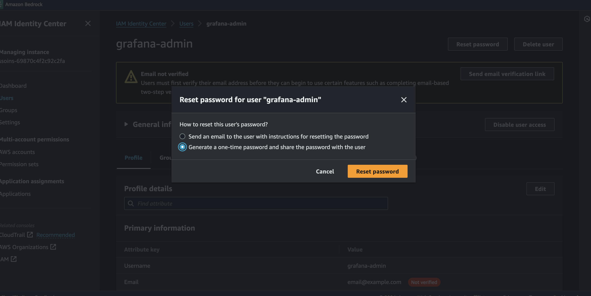
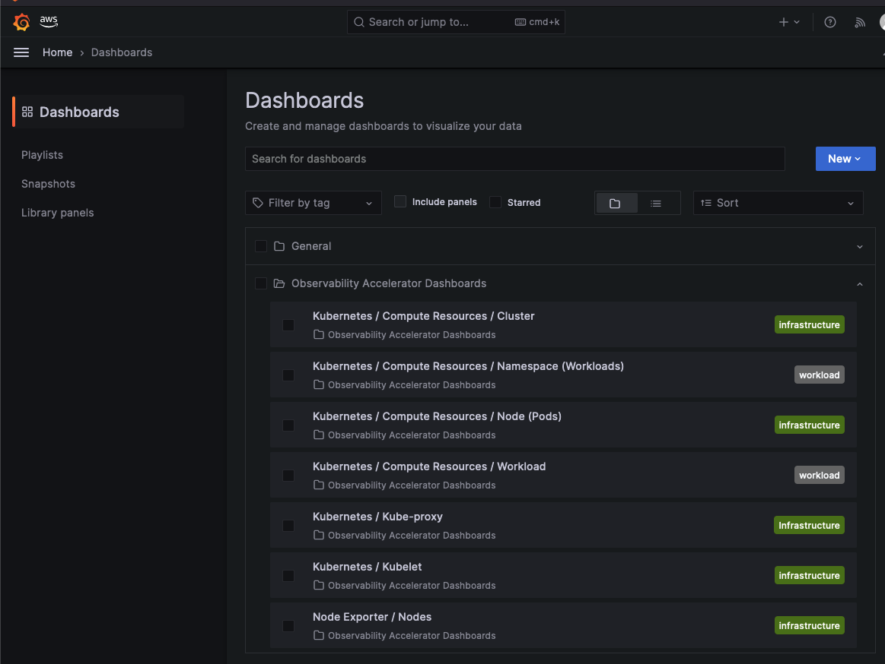
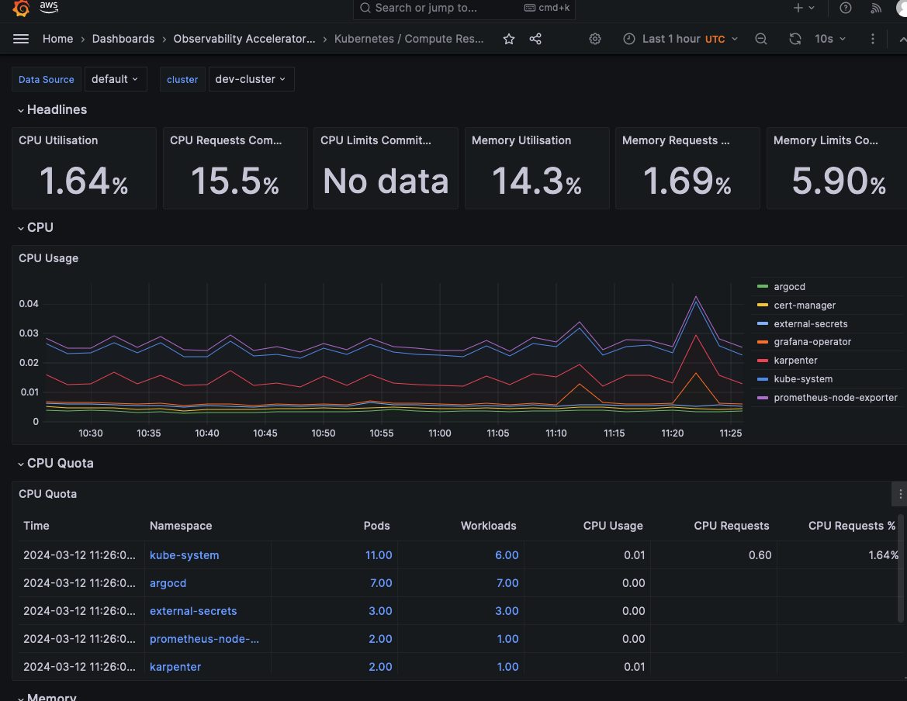
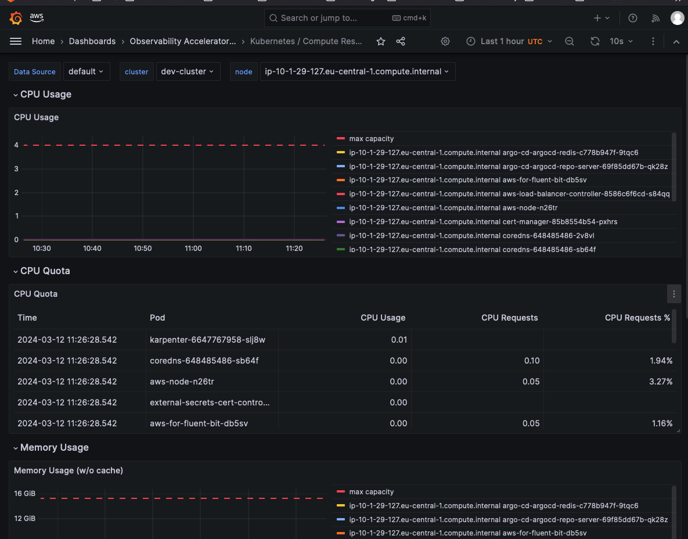

# Observing Amazon EKS Cluster with AWS services for OSS tooling

This part of this pattern help you to monitor your Amazon Elastic Kubernetes Service (Amazon EKS) cluster with the AWS Observability tooling for OSS tooling. This includes the following resources:
* [Amazon Managed Service for Prometheus](https://docs.aws.amazon.com/prometheus/latest/userguide/what-is-Amazon-Managed-Service-Prometheus.html) for storing metrics
* Amazon Managed Service for Prometheus [Managed Collector](https://docs.aws.amazon.com/prometheus/latest/userguide/AMP-collector.html)
* [Amazon Managed Grafana](https://docs.aws.amazon.com/grafana/latest/userguide/what-is-Amazon-Managed-Service-Grafana.html) - for metrics visualization 
* AWS Identity Store user - this is a prerequisite to authenticate to an Amazon Managed Grafana workspace
* [grafana-operator](https://grafana.github.io/grafana-operator/docs/) - this operator allows admin to manage grafana data-source, dashboards, and other configuration directly from Kubernetes using Custom-Resources
* Observability specific addons - [Prometheus node-exporter](https://github.com/prometheus/node_exporter) and [kube-state-metrics](https://github.com/kubernetes/kube-state-metrics)

## Prerequisites  

Since AMG uses [IAM Identity Center](https://docs.aws.amazon.com/grafana/latest/userguide/authentication-in-AMG-SSO.html) to provide authentication to the AMG workspace, you'll have to enable IAM Identity center before deploying this pattern.


## Using the services deployed in this part

### AMP

To access AMP Workspace, you'll have to use `awscurl` as guided in the [docs](https://docs.aws.amazon.com/prometheus/latest/userguide/AMP-compatible-APIs.html). At the bottom of this page, there's a troubleshooting section with useful commands.

### AMG 

Since AMG uses IAM Identity Center to provide authentication to the AMG workspace, and since this automation deploy a default `grafana-admin` user that is allowed to access the workspace, you'll need to reset its password through the console. See the image below 

After logging into the AMG workspace, you should expect to see the following dashboards already configured and ready to use:






### CloudWatch logs 
 
Although CW logs are not configured in this folder, the log-group convention to access the CW logs ingested by the [AWS for fluentbit](https://github.com/aws/aws-for-fluent-bit) addon is `/aws/eks/<CLUSTER_NAME>/aws-fluentbit-logs`

## Architecture Decisions  

### Using AWS Managed Services for OSS Observability tooling

#### Context

This pattern run a single Amazon EKS cluster per environment in a single account. One of the reasons for that is to simplify the operational processes for managing the cluster and its infrastructure (including connected services, addons, etc...).

#### Decision

To reduce the need to manage observability tooling and infrastructure, this pattern  use the Amazon Managed Service for Prometheus (AMP), and the Amazon Managed Grafana (AMG) as the observability metric database and visualization service. Amazon Cloudwatch is used as the logging visualization tool alongside with a deployed addon of aws-fluent-bit. It  also use an in-cluster Prometheus [kube-stack](https://github.com/prometheus-community/helm-charts/tree/main/charts/kube-prometheus-stack), or manage and [ADOT Collector](https://aws-otel.github.io/docs/getting-started/adot-eks-add-on), this pattern uses the recently launched [AWS Managed Collector](https://docs.aws.amazon.com/prometheus/latest/userguide/AMP-collector-how-to.html) for AMP.

#### Consequences

Consequences of this decisions, true to the date of writing this README, is that there is a 1:1 mapping between an EKS cluster and an AMP workspace, meaning that each cluster will have its own AMP workspace. This shouldn't be a concern as the design consideration of this pattern is to create isolated per-environment deployments of the cluster, its supporting services, and addons.

A challenging consequent of this decision, is that currently the AWS Managed Collector is using the previous way of authenticating to an EKS cluster, using the `aws-auth` [ConfigMap entry](https://docs.aws.amazon.com/eks/latest/userguide/add-user-role.html), and not the new [EKS Cluster Access Management](https://docs.aws.amazon.com/eks/latest/userguide/access-entries.html) feature of managing access to the EKS Cluster using Amazon EKS APIs. Because of that, the AWS Managed Collector role needs to be added with `eksctl` which is the best available tool to this date to manage `aws-auth` configMap entries. 
> **_NOTE:_**  keep an eye on the output of this terraform folder which includes the `eksctl` command to create the entry for the AWS Managed Scraper IAM Role

### Grafana-Operator to configure AMG workspace

#### Context

To provide a complete solution in this pattern, the observability resources needs to be configured as part of the deployment of this pattern. This includes connecting the AMP workspace as a data-source for the AMG workspace,  deploying set of predefined dashboards as a starting point, and a process to deploy new dashboards in the same way the "basic"/predefined dashboards were deployed.

#### Decision

Since the AMG API doesn't support managing the workspace APIs itself (meaning the grafana APIs), and only the AMG service specific configurations, this pattern use the [grafana-operator](https://grafana.github.io/grafana-operator/docs/) to connect to the AMG workspace, and deploy dashboards into it.

#### Consequences

1. The grafana operator requires the cluster to have a API key stored as a Kubernetes secret in the cluster so that the grafana-operator can connect to the workspace. That means that the API key is generated and stored in the cluster itself
2. The dashboards are managed as assets/files stored in a GitRepo and synced to the AMG workspace continuously 
3. TBD - use of an API key require a process for rotating a key and redeploying it to system manager as a secret object, and sync it to the cluster afterwards (using ESO - External Secrets Operator)

## Deploy it

To deploy this folder resources to a specific resources, use the following commands

```
terraform init --backend-config=../../00.global/global-backend-config
terraform workspace new <YOUR_ENV>
terraform workspace select <YOUR_ENV>
terraform apply -var-file="../../00.global/vars/dev.tfvars"
```


## Troubleshooting

### How can I check that metrics are ingested to the AMP workspace 

Using `awscurl` allows you to interact with 

Use the following command samples to query collecting jobs running, labels collected, and metrics values:

```bash 
REGION=<YOUR_REGION>
WSID=<YOUR_AMP_WORKSPACE_ID>

# List jobs collecting metrics
awscurl --service="aps" --region=$REGION "https://aps-workspaces.$REGION.amazonaws.com/workspaces/$WSID/api/v1/label/job/values" | jq

# List labels collected
awscurl --service="aps" --region=$REGION "https://aps-workspaces.$REGION.amazonaws.com/workspaces/$WSID/api/v1/label/__name__/values" | jq

# List values for a specific label
awscurl --service="aps" --region=$REGION "https://aps-workspaces.$REGION.amazonaws.com/workspaces/$WSID/api/v1/query?query=apiserver_request_duration_seconds_bucket" | jq

```


## Terraform docs
<!-- BEGINNING OF PRE-COMMIT-TERRAFORM DOCS HOOK -->
## Requirements

| Name | Version |
|------|---------|
| <a name="requirement_terraform"></a> [terraform](#requirement\_terraform) | >= 1.1.0 |
| <a name="requirement_aws"></a> [aws](#requirement\_aws) | >= 5.40.0 |
| <a name="requirement_helm"></a> [helm](#requirement\_helm) | >= 2.4.1 |
| <a name="requirement_kubectl"></a> [kubectl](#requirement\_kubectl) | >= 2.0.3 |
| <a name="requirement_kubernetes"></a> [kubernetes](#requirement\_kubernetes) | >= 2.10 |
| <a name="requirement_null"></a> [null](#requirement\_null) | >= 3.0 |
| <a name="requirement_time"></a> [time](#requirement\_time) | 0.10.0 |

## Providers

| Name | Version |
|------|---------|
| <a name="provider_aws"></a> [aws](#provider\_aws) | >= 5.40.0 |
| <a name="provider_helm"></a> [helm](#provider\_helm) | >= 2.4.1 |
| <a name="provider_kubectl"></a> [kubectl](#provider\_kubectl) | >= 2.0.3 |
| <a name="provider_null"></a> [null](#provider\_null) | >= 3.0 |
| <a name="provider_terraform"></a> [terraform](#provider\_terraform) | n/a |
| <a name="provider_time"></a> [time](#provider\_time) | 0.10.0 |

## Modules

| Name | Source | Version |
|------|--------|---------|
| <a name="module_managed_grafana"></a> [managed\_grafana](#module\_managed\_grafana) | terraform-aws-modules/managed-service-grafana/aws | 2.1.1 |

## Resources

| Name | Type |
|------|------|
| [aws_grafana_workspace_api_key.this](https://registry.terraform.io/providers/hashicorp/aws/latest/docs/resources/grafana_workspace_api_key) | resource |
| [aws_identitystore_group.group](https://registry.terraform.io/providers/hashicorp/aws/latest/docs/resources/identitystore_group) | resource |
| [aws_identitystore_group_membership.group_membership](https://registry.terraform.io/providers/hashicorp/aws/latest/docs/resources/identitystore_group_membership) | resource |
| [aws_identitystore_user.user](https://registry.terraform.io/providers/hashicorp/aws/latest/docs/resources/identitystore_user) | resource |
| [aws_kms_key.secrets](https://registry.terraform.io/providers/hashicorp/aws/latest/docs/resources/kms_key) | resource |
| [aws_prometheus_rule_group_namespace.recording_rules](https://registry.terraform.io/providers/hashicorp/aws/latest/docs/resources/prometheus_rule_group_namespace) | resource |
| [aws_prometheus_scraper.amp_scraper](https://registry.terraform.io/providers/hashicorp/aws/latest/docs/resources/prometheus_scraper) | resource |
| [aws_prometheus_workspace.this](https://registry.terraform.io/providers/hashicorp/aws/latest/docs/resources/prometheus_workspace) | resource |
| [aws_ssm_parameter.secret](https://registry.terraform.io/providers/hashicorp/aws/latest/docs/resources/ssm_parameter) | resource |
| [helm_release.grafana_operator](https://registry.terraform.io/providers/hashicorp/helm/latest/docs/resources/release) | resource |
| [helm_release.kube_state_metrics](https://registry.terraform.io/providers/hashicorp/helm/latest/docs/resources/release) | resource |
| [helm_release.prometheus_node_exporter](https://registry.terraform.io/providers/hashicorp/helm/latest/docs/resources/release) | resource |
| [kubectl_manifest.amg_remote_identity](https://registry.terraform.io/providers/alekc/kubectl/latest/docs/resources/manifest) | resource |
| [kubectl_manifest.amp_data_source](https://registry.terraform.io/providers/alekc/kubectl/latest/docs/resources/manifest) | resource |
| [kubectl_manifest.amp_scraper_clusterrole](https://registry.terraform.io/providers/alekc/kubectl/latest/docs/resources/manifest) | resource |
| [kubectl_manifest.amp_scraper_clusterrolebinding](https://registry.terraform.io/providers/alekc/kubectl/latest/docs/resources/manifest) | resource |
| [kubectl_manifest.cluster_secretstore](https://registry.terraform.io/providers/alekc/kubectl/latest/docs/resources/manifest) | resource |
| [kubectl_manifest.default_dashboards](https://registry.terraform.io/providers/alekc/kubectl/latest/docs/resources/manifest) | resource |
| [kubectl_manifest.secret](https://registry.terraform.io/providers/alekc/kubectl/latest/docs/resources/manifest) | resource |
| [null_resource.clean_up_argocd_resources](https://registry.terraform.io/providers/hashicorp/null/latest/docs/resources/resource) | resource |
| [time_rotating.this](https://registry.terraform.io/providers/hashicorp/time/0.10.0/docs/resources/rotating) | resource |
| [time_static.this](https://registry.terraform.io/providers/hashicorp/time/0.10.0/docs/resources/static) | resource |
| [aws_caller_identity.current](https://registry.terraform.io/providers/hashicorp/aws/latest/docs/data-sources/caller_identity) | data source |
| [aws_eks_cluster.this](https://registry.terraform.io/providers/hashicorp/aws/latest/docs/data-sources/eks_cluster) | data source |
| [aws_eks_cluster_auth.this](https://registry.terraform.io/providers/hashicorp/aws/latest/docs/data-sources/eks_cluster_auth) | data source |
| [aws_region.current](https://registry.terraform.io/providers/hashicorp/aws/latest/docs/data-sources/region) | data source |
| [aws_ssoadmin_instances.current](https://registry.terraform.io/providers/hashicorp/aws/latest/docs/data-sources/ssoadmin_instances) | data source |
| [kubectl_path_documents.default_dashboards_manifest](https://registry.terraform.io/providers/alekc/kubectl/latest/docs/data-sources/path_documents) | data source |
| [terraform_remote_state.eks](https://registry.terraform.io/providers/hashicorp/terraform/latest/docs/data-sources/remote_state) | data source |
| [terraform_remote_state.eks_addons](https://registry.terraform.io/providers/hashicorp/terraform/latest/docs/data-sources/remote_state) | data source |
| [terraform_remote_state.vpc](https://registry.terraform.io/providers/hashicorp/terraform/latest/docs/data-sources/remote_state) | data source |

## Inputs

| Name | Description | Type | Default | Required |
|------|-------------|------|---------|:--------:|
| <a name="input_go_config"></a> [go\_config](#input\_go\_config) | Grafana Operator configuration | <pre>object({<br>    create_namespace   = optional(bool, true)<br>    helm_chart         = optional(string, "oci://ghcr.io/grafana-operator/helm-charts/grafana-operator")<br>    helm_name          = optional(string, "grafana-operator")<br>    k8s_namespace      = optional(string, "grafana-operator")<br>    helm_release_name  = optional(string, "grafana-operator")<br>    helm_chart_version = optional(string, "v5.5.2")<br>  })</pre> | <pre>{<br>  "create_namespace": true,<br>  "helm_chart": "oci://ghcr.io/grafana-operator/helm-charts/grafana-operator",<br>  "helm_chart_version": "v5.5.2",<br>  "helm_name": "grafana-operator",<br>  "helm_release_name": "grafana-operator",<br>  "k8s_namespace": "grafana-operator"<br>}</pre> | no |
| <a name="input_grafana_admin_email"></a> [grafana\_admin\_email](#input\_grafana\_admin\_email) | default email for the grafana-admin user | `string` | `"email@example.com"` | no |
| <a name="input_ksm_config"></a> [ksm\_config](#input\_ksm\_config) | Kube State metrics configuration | <pre>object({<br>    create_namespace   = optional(bool, true)<br>    k8s_namespace      = optional(string, "kube-system")<br>    helm_chart_name    = optional(string, "kube-state-metrics")<br>    helm_chart_version = optional(string, "5.16.1")<br>    helm_release_name  = optional(string, "kube-state-metrics")<br>    helm_repo_url      = optional(string, "https://prometheus-community.github.io/helm-charts")<br>    helm_settings      = optional(map(string), {})<br>    helm_values        = optional(map(any), {})<br><br>    scrape_interval = optional(string, "60s")<br>    scrape_timeout  = optional(string, "15s")<br>  })</pre> | `{}` | no |
| <a name="input_ne_config"></a> [ne\_config](#input\_ne\_config) | Node exporter configuration | <pre>object({<br>    create_namespace   = optional(bool, true)<br>    k8s_namespace      = optional(string, "prometheus-node-exporter")<br>    helm_chart_name    = optional(string, "prometheus-node-exporter")<br>    helm_chart_version = optional(string, "4.24.0")<br>    helm_release_name  = optional(string, "prometheus-node-exporter")<br>    helm_repo_url      = optional(string, "https://prometheus-community.github.io/helm-charts")<br>    helm_settings      = optional(map(string), {})<br>    helm_values        = optional(map(any), {})<br><br>    scrape_interval = optional(string, "60s")<br>    scrape_timeout  = optional(string, "60s")<br>  })</pre> | `{}` | no |
| <a name="input_observability_configuration"></a> [observability\_configuration](#input\_observability\_configuration) | observability configuration variable | <pre>object({<br>    aws_oss_tooling        = optional(bool, true)  // AMP & AMG<br>    aws_native_tooling     = optional(bool, false) // CW<br>    aws_oss_tooling_config = optional(map(any), {})<br>  })</pre> | <pre>{<br>  "aws_native_tooling": false,<br>  "aws_oss_tooling": true,<br>  "aws_oss_tooling_config": {<br>    "enable_grafana_operator": true,<br>    "enable_managed_collector": true,<br>    "enable_self_managed_collectors": false,<br>    "prometheus_name": "prom"<br>  }<br>}</pre> | no |
| <a name="input_prometheus_name"></a> [prometheus\_name](#input\_prometheus\_name) | Amazon Managed Service for Prometheus Name | `string` | `"prom"` | no |
| <a name="input_tags"></a> [tags](#input\_tags) | Additional tags | `map(string)` | `{}` | no |

## Outputs

| Name | Description |
|------|-------------|
| <a name="output_eksctl_create_amp_scraper_identitymapping_command"></a> [eksctl\_create\_amp\_scraper\_identitymapping\_command](#output\_eksctl\_create\_amp\_scraper\_identitymapping\_command) | n/a |
<!-- END OF PRE-COMMIT-TERRAFORM DOCS HOOK -->